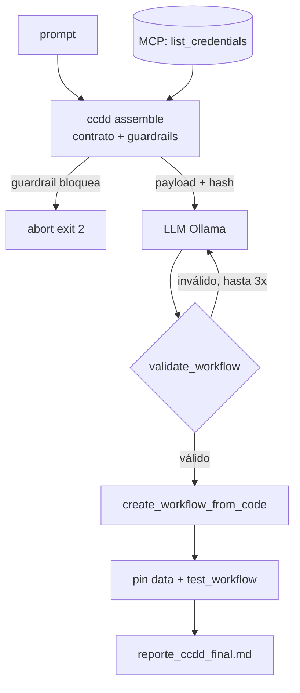

# n8n-generator

[](https://github.com/MauricioPerera/n8n-generator/actions/workflows/ccdd-gate.yml)
[](https://github.com/MauricioPerera/n8n-generator/actions/workflows/pipeline-smoke.yml)
[](https://github.com/MauricioPerera/ccdd)
[](LICENSE)

Generador de **workflows de [n8n](https://n8n.io/)** a partir de un prompt en lenguaje natural,
alineado con la metodología **[CCDD](https://github.com/MauricioPerera/ccdd)** (Context
Contract-Driven Development): el contexto que recibe el LLM se declara como un **contrato**
(`context.yaml`), se ensambla de forma verificable y se valida con guardrails *antes* de inferir.

Toma un prompt, arma el contexto bajo contrato, consulta un LLM local (Ollama), genera código del
`@n8n/workflow-sdk`, y lo valida / crea / testea contra una instancia de n8n vía un servidor MCP.

> **Estado:** prueba de concepto, con la **gobernanza CCDD enforceada**. El runtime (ensamblado +
> guardrails, **L3**) corre antes de cada inferencia; **L1 (firmas) y L2 (gate de regresión)** corren
> en CI ([`.github/workflows/ccdd-gate.yml`](.github/workflows/ccdd-gate.yml)) como *required check*
> sobre una `main` protegida — un cambio que debilite el contrato no puede mergearse, y cambiar un
> prompt firmado exige una atestación Ed25519 de revisor. El gate clona la referencia de CCDD
> pinneada por **SHA inmutable** (== release `v0.3.1`).

## Cómo funciona (pipeline CCDD)



`generate_with_ccdd.js` ejecuta:

1. Lista las credenciales de la instancia n8n vía MCP (`list_credentials`).
2. Escribe `inputs.json` con el `user_prompt` y las credenciales disponibles (slots runtime/dynamic).
3. **Corre `ccdd.py assemble`** — ensambla el contexto por prioridad y corre los guardrails. Si un
   guardrail bloquea (p. ej. un secreto), **el pipeline aborta** (exit 2).
4. Lee el payload ensamblado y su hash de `last-assembly.json` (auditable / reproducible).
5. Consulta el LLM local (Ollama) con ese payload.
6. Valida el código generado (`validate_workflow` vía MCP); si no valida, le devuelve los errores al
   modelo y reintenta (**loop de auto-corrección**, hasta 3 intentos).
7. Crea el workflow en n8n (`create_workflow_from_code`).
8. Prepara pin data de prueba.
9. Corre un test run y escribe `reporte_ccdd_final.md`.

El **contrato** (`context.yaml`) declara 4 slots, más guardrails `no-secrets` y `slot-references`.
Por prioridad (menor = más retención; los críticos nunca se recortan):

```
prio 0  system_instructions   estático · firmado   ── nunca se recorta
prio 1  sdk_reference         estático · firmado   ── nunca se recorta
prio 2  available_credentials dinámico (MCP)       ── truncable, máx 1000 tok
prio 3  user_prompt           runtime              ── truncable
        presupuesto: 8192 tok entrada − 1500 reservados para la salida
```

## Prerrequisitos

- **[Ollama](https://ollama.com/)** corriendo en `localhost:11434` con el modelo `qwen2.5:1.5b` (o el
  que configures vía `OLLAMA_MODEL`). `ollama pull qwen2.5:1.5b`.
- Una instancia de **n8n** (por defecto en `localhost:5678`).
- El **n8n MCP Server** (el oficial, verificado v1.1.0, en `…/mcp-server/http`) — ver el
  [contrato](docs/MCP_CONTRACT.md). El módulo `run_mcp_action.js` (incluido) expone `callMcp(...)`:
  modo **real** (streamable-HTTP + SSE + Bearer vía `N8N_MCP_URL`/`N8N_MCP_TOKEN`) y modo **mock**
  determinista (`MCP_MOCK=1`) para correr/probar sin n8n vivo.
- La **implementación de referencia de CCDD** ([`ccdd.py`](https://github.com/MauricioPerera/ccdd)) y
  un Python con `pyyaml`, `jsonschema`, `cryptography`.
- Node.js 18+ (usa `fetch` nativo).

## Configuración (variables de entorno)

El pipeline CCDD es configurable para que sea portable:

| Variable | Default | Qué es |
| :--- | :--- | :--- |
| `OLLAMA_URL` | `http://localhost:11434/api/chat` | Endpoint de Ollama |
| `OLLAMA_MODEL` | `qwen2.5:1.5b` | Modelo a usar |
| `CCDD_PYTHON` | `python` | Intérprete con las deps de CCDD |
| `CCDD_PATH` | `./ccdd_reference/ccdd.py` | Ruta al `ccdd.py` de la referencia |

```bash
export CCDD_PATH=/ruta/a/ccdd/ccdd_reference/ccdd.py
npm start -- "Crea un flujo que se active con un webhook, filtre por 'error', y envíe por Gmail"
# (equivalente a: node generate_with_ccdd.js "…")
npm test        # smoke: pipeline e2e con n8n+LLM mock y ensamble CCDD real
```

Un ejemplo de la salida real del pipeline está en [`reporte_ejemplo.md`](reporte_ejemplo.md).

## Entrypoints

| Archivo | Qué hace | CCDD |
| :--- | :--- | :--- |
| `generate_with_ccdd.js` | **Pipeline canónico** — contrato + assemble + guardrails | ✅ L3 runtime (+ L1/L2 en CI) |
| `generate_and_verify.js` | Pipeline previo, prompt directo sin contrato | ❌ no |
| `n8n_generator.py` | Generador Python con function-calling (Ollama), standalone | ❌ no |
| `test_pipeline_smoke.js` | Smoke: contrato del mock MCP + pipeline e2e con **ensamble CCDD real** | — (prueba) |

### Probar sin infraestructura

El smoke test corre el pipeline de punta a punta mockeando lo externo (n8n + LLM) pero ejecutando el
**ensamble CCDD real**. Es lo que valida el CI ([`pipeline-smoke.yml`](.github/workflows/pipeline-smoke.yml)):

```bash
CCDD_PATH=/ruta/a/ccdd/ccdd_reference/ccdd.py npm test
```

## Limitaciones conocidas

Honestidad de alcance, en la misma línea que CCDD:

- **El pipeline completo requiere infraestructura externa**: una instancia de n8n viva, su servidor
  MCP y Ollama. Eso no corre en CI — el smoke test (`test_pipeline_smoke.js`) mockea n8n y el LLM con
  frontera explícita y ejerce el ensamble CCDD real. Para el flujo de punta a punta hace falta ese
  stack local.
- **Modelo chico** (`qwen2.5:1.5b` por defecto) con loop de auto-corrección: es un PoC, no producción.
- `generate_and_verify.js` y `n8n_generator.py` son variantes **sin** contrato CCDD (ver *Entrypoints*).

El gate de gobernanza, las atestaciones y la corrección del `import` de `expr` (que antes figuraban
acá como pendientes) ya están resueltos y enforceados; ver *Estado* arriba.

## Licencia

[MIT](LICENSE).
